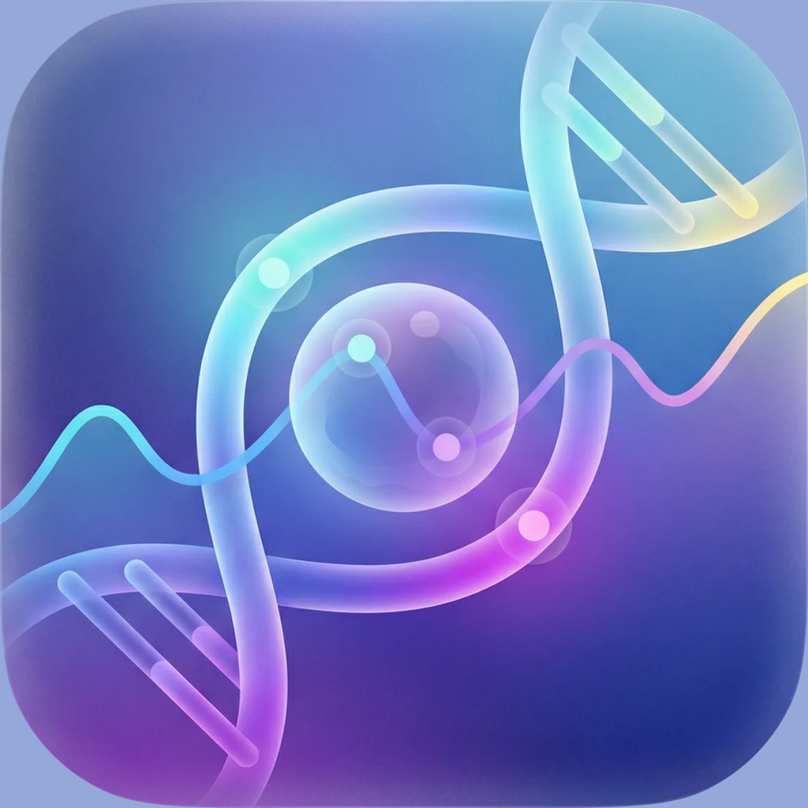

<p></p>

<h1>Aura Health</h1>

<p>Your vitals, labs, medications, habits, and health notes in one private dashboard.<br>
Built for people who want to understand their own data, not just collect it.</p>

<p><strong>Version 1.0.0</strong> · iPhone · iOS 17+</p>

<p>
  
  
  
  
</p>

<p><a href="#build-from-source">Build Aura from source</a></p>


I started Aura after the spreadsheet where I tracked biomarkers, habits, and health notes became harder to understand than the data inside it. The first version was a web app. Moving it to Swift made a focused, private iPhone experience and Apple Health integration possible.

Aura is currently distributed as source while its first App Store release is prepared. Health data stays in the app's local SwiftData store on your iPhone.

## What Aura keeps together

The main dashboard brings heart rate, HRV, blood pressure, sleep, steps, weight, SpO2, skin temperature, calories, and other measurements into one timeline. Each metric includes a trend, reference range, and a short explanation. Time filters run from the current day through the full history.


Habits, medications, supplements, conditions, diet notes, and lab sessions live beside the measurements they may affect. Biomarkers are grouped by body system, and previous lab sessions remain available as dated snapshots. Correlation views help compare pairs such as sleep and recovery or HRV and strain.

The optional health assistant can read and update vitals, biomarkers, medications, and habits. Attach a lab report as a PDF or photo and it can extract values for review before saving them. You choose Anthropic or OpenRouter and use your own API key.


https://github.com/user-attachments/assets/d81e0380-41ab-45e5-b22e-92e15c38edad

## Data and privacy

There is no Aura account, developer-owned health-data server, analytics service, advertising, or telemetry. Health data and documents stay in Aura's local database on your iPhone.

AI stays off until you choose Anthropic or OpenRouter, add your own API key, and allow processing. When you explicitly send a message or attachment, Aura sends that content and health records returned by its read tools for that request to the selected provider. Nothing is sent automatically.

Aura can read Apple Health data, accept manual entries, import lab values from chat attachments, and create or restore a complete JSON backup.

Read the [privacy policy](PRIVACY.md) and [support guide](SUPPORT.md).

## Build from source

Clone the repository, open `AuraHealth.xcodeproj`, and build the iPhone target in Xcode.

```bash
git clone https://github.com/madebysan/aura-health.git
cd aura-health
open AuraHealth.xcodeproj
```

On first launch, optionally grant read-only Apple Health access. Configure Anthropic or OpenRouter under **Settings → AI** only if you want to use the assistant.

## Known limitations

Lab extraction depends on the image and document quality. Unusual formats or low-resolution photos can produce incomplete results, so every extracted value remains editable before it is saved.

Aura is an organizational and educational wellness tool. It is not a medical device and does not diagnose, treat, or replace advice from a qualified healthcare professional.

## Tech stack

- Swift and SwiftUI for iPhone
- SwiftData for local storage
- read-only HealthKit integration
- Anthropic and OpenRouter for optional AI chat
- Keychain storage for provider API keys

## Feedback

Found a bug or have a feature idea? [Open an issue](https://github.com/madebysan/aura-health/issues).

## License

[MIT](LICENSE)

Made by [santiagoalonso.com](https://santiagoalonso.com)
